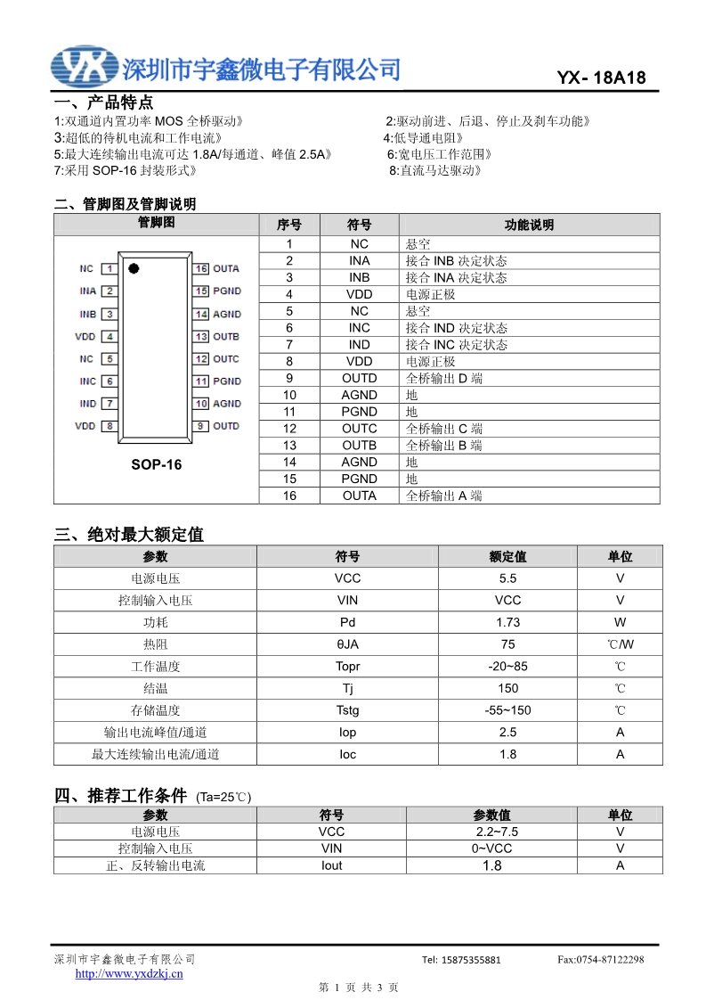
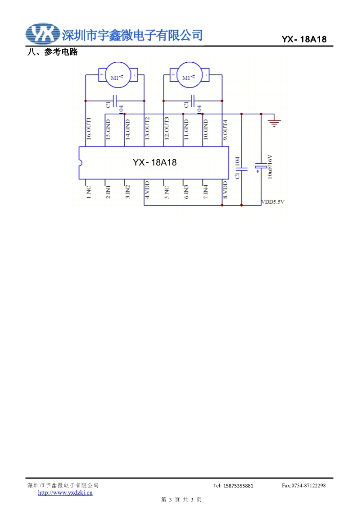

# BLE Car
A radio controlled car modified to use be controlled with Bluetooth Low Energy. Arduino nano 33 BLE and the ArduinoBLE library to be specific.

## Original car
The original car was a toy. You could not controll the speed r steering, it was just max or nothing. The receiver consisted of a RF receiver and a motor driver/h-bridge called YX18181AM.

## Modified car

The reciever is a Arduino Nano 33 BLE, which replaces the old radio receiver. The traces for the RF receiver are cut. The Arduino is connecting to the same motor driver chip as the original receiver.

## Remote control web app
The remote control is a web app. It uses Web Bluetooth to cend data, which is supported on some browsers (chrome) on some platforms (Android, macOs).

[Live](https://mnomn.github.io/car/index.html)

[Code](https://github.com/mnomn/mnomn.github.io/tree/master/car)

## References
 "H-Bridge 1")

 "H-Bridge 1")
